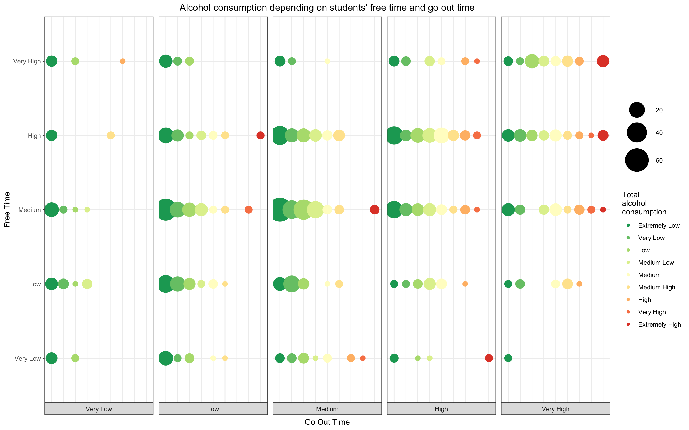

```{r Setting template options, include=FALSE}
knitr::opts_chunk$set(eval = FALSE)
```


The most important objective of this Data Visualization project was to create beautiful, informative and yet sophisticated visualizations. Clear visual representation of data is very important, as humans perceive a major part of information through vision.  
In this report I will walk you through my journey on how I created one of my visualizations and the idea behind it.

The name of my plot is "Alcohol consumption depending on students' free time and go out time". This figure was created using the Student Performance Data Set of Portugees students survey. 

This visual displays the relationship between students’ free time and go out time and the level of their alcohol consumption. The x axis represents students’ go out time and y axis - students’ free time. Both of these variables have five different levels  - from very low to very high. The size of the bubbles represents the number of students and color transition nicely shows the change in the total level of alcohol consumption from extremely low (green) to extremely high (red).



This figure conveys a very important message, that there is a general trend that the more students have free time and the more they go out - the level of their alcohol consumption increases. 

Who may be interested in this kind of information? This visualization was created for the general public, so anyone can grasp the idea behind this figure easily. However, there are few groups of audience who could particularly benefit from knowing the information that this figure represents.  
First of all - it’s **parents**. Not just parents of these specific students, but any parents. In this case they can see that for young people it is natural to go out and sometimes to have a drink or few. Also, on the other hand, there is a big population of students who don’t consume alcohol or consume it at very low levels. This can be a proof that everage student who has some moderate amount of free time and go out time isn’t consuming high levels of alcohol. So parents could understand these trends better and this hopefully will help to build a bridge of trust between two generations: parents and their children.  
The second target group could be **teachers**. Just as parents, it is useful for them to understand students and the relationship between students’ free time, go out time and levels of alcohol consumption. And see how this could influence how well their students do at school (other plots covered in a group project) and maybe help them to determine the homework load as well.  
The third target audience is **students**. They could be interested to understand these relationships as well. Also, they are probably curious about their piers and to see where they stand compared to themselves.  
The other big group - is the **researchers** (as us). They would like to analyze, study and understand these relations for scientific purposes. Although researchers would need a lot more information than this figure alone, such as the data itself.  
The information that this figure conveys could be useful for commercial purposes as well. **Marketers** could be very interested in this type of information, especially when they are in the business of selling alcoholic beverages. They can study and analyze these trends and use it to their advantage to target young people (unfortunately) by different marketing campaigns.  
**Insurance companies** are also very interested in this kind of information. For example life insurance, health insurance and car insurance companies, as they can use this information to determine the premium quotes and the risk level depending on students' alcohol consumption levels.  
These are just a few of top target groups for this visualization, however as mentioned previously there are potentially many more.

I chose this type of visualization, because how well it represents the general trend in the overall level of students’ alcohol consumption, the size of each bubble group and the levels of students’ free time and go out time. Also, just the fact that this relationship exists makes this visualization very compelling.

I’ve made many design decisions while working on this visualization. Here is my R code - I've created this figure in R-Studio using the ggplot2 package.

```{r}

p7 <- full_df %>% 
  ggplot(aes(y=freetime, x=Salc, color=Salc, group=freetime)) +
  geom_count() + 
  scale_size(range = c(3, 15)) +
  scale_color_manual(values=colours_9, name="Total \nalcohol \nconsumption") +
  theme_bw() +
  theme(axis.text.x = element_blank(),
        axis.ticks.x = element_blank(),
        panel.spacing.x=unit(0.5, "lines")) +
  facet_grid(. ~ goout, switch="both") +
  labs(x = "Goout",
       size = "")+
  xlab("Go Out Time")+
  ylab("Free Time")+
  ggtitle("Alcohol consumption depending on students' free time and go out time")+
  theme(plot.title = element_text(hjust = 0.5))
p7
  
```

Let’s look at it line by line.  
First of all, I have used ggplots’ aesthetics and defined the x axis as Total Alcohol Consumption `x=Salc`.  We have created the variable `Salc` ourselves by combining two other variables from our data: `Dalc` - weekday alcohol consumption and `Walc` - weekend alcohol consumption (please find code below). Variable `Salc` has 9 levels ranging from ‘Extremely Low’ to ‘Extremely High’. I also colored the points in my plot with this variable `color=Salc` (more on color decision later in this report).

```{r}

  mutate_at(vars(Salc), 
             ~plyr::mapvalues(.x %>% as.factor(), from=2:10, 
             to=c("Extremely Low", "Very Low", "Low", "Medium Low", "Medium", 
                  "Medium High", "High", "Very High", "Extremely High")))

```

Next, I have defined the y axis as students’ Free Time `y=freetime`, grouped by Free time `group=freetime`. 

I used `geom_count()` to count points that correspond to the number of students at each location, then map the count to point area. The overlapping effect of points was created on purpose. This gives this visualization a nice perception and smooth transition from smaller to bigger bubbles with clean but informative design. The size of the points is defined and controlled by `scale_size(range = c(3, 15))`. This range of size 3 for the smallest points and size 15 for the largest I have found to be the best. Points were too small when first number in range was 1 and way too big when second number was more than 15 (I have tried 18, 20, 25, 30 - they all were too large). `geom_count()` also automatically created a legend with bubble sizes.

The following line `scale_color_manual(values=colours_9, name="Total \nalcohol \nconsumption")` is very important for creation of this plot. Here I have colored my points in the spectrum from green to red with yellow as a middle gradient. This creates a nice visual perception where green is good, meaning low levels of alcohol consumption and red being bad - very high levels of alcohol consumption.  
For this purpose, I have used the RColorBrewer library and palette  'RdYlGn'. Numbers [9:1] mean that I would like the spectrum in reverse from green to red in 9 levels with yellows in between.

```{r}

colours_9 = RColorBrewer::brewer.pal(9, 'RdYlGn')[9:1]

```


`scale_color_manual()` is also responsible for the color legend. Instead of having variable name `Salc` as the legend title (which is default and not very informative), I have manually defined it as “Total alcohol consumption” via parameter `name`. In this case the legend looks very nice and also carries valuable information about alcohol consumption levels.

ggplot2 has a grey background and white gridlines as default, which is a modern and nice look in some cases. For our group project we have decided to use dark-on-light ggplot2 theme `theme_bw()`. White background creates a clean and at the same time classic look. This visualization was created to be in par with our concept, at the same time making it easier for an eye to see points and making the colors pop. And as a result it created a beautiful effect, so color points don’t blend in with the background.

I used `facet_grid(. ~ goout, switch="both")` to form a nice matrix of panels defined by row and column faceting variables. It worked really well in this case, since both x-axis and y-axis are discrete variables. `facet_grid()` has splitted `goout` variable into 5 'panels’, indicated by `~ goout`. The dot in the formula is used to indicate there should be no faceting on ‘freetime’ dimension. `switch="both"` was used so that the labels are displayed on the bottom and left of the plot. This was a design decision that was meant to display labels the way the x and y axis labels are displayed traditionally, and has made this figure easier to perceive.

```{r}

theme(axis.text.x = element_blank(),
        axis.ticks.x = element_blank(),
        panel.spacing.x=unit(0.5, "lines"))

```


Since `facet_grid()` did such a good job with x axis labeling, there was no need to include x axis ticks and text, this was done with `axis.text.x = element_blank()` and  `axis.ticks.x = element_blank()`.  
`panel.spacing.x=unit(0.5, "lines")` was used to create spacing between legend keys.

And with this line `labs(x = "Goout", size = "")` I defined that the values of variable `Goout` would be the labels for x axis.

I created the titles for x axis with `xlab("Go Out Time"))` and y axis with `ylab("Free Time")`. 

And finally I named my plot with `ggtitle("Alcohol consumption depending on students' free time and go out time")` and placed the main title (at the top) and centered it with `theme(plot.title = element_text(hjust = 0.5)`. Considering that the title is quite long - centering it made the plot figure look proportional.

This is just one visualization example among few others that I have created. I believe that this figure has served its purpose and relayed the information intended for the viewer.

This project and Data Visualization course have taught me many useful and necessary skills on creating informative, elegant, and at the same time complex visualizations. 
I have learned how to use many R tools and libraries. And I have learned how to overcome the challenges as well.  
I also found out that one can get stuck in the “perfectionist loop”, when there is no limit to perfection and hours and days may pass by in the search for the most perfect figure. 

Nevertheless, I am finishing this project and Data Visualization course with the feeling of great accomplishment. I believe that overcoming all the hurdles and constant learning of something new have helped me to grow professionally.  
As a future data scientist, I found this experience to be particularly valuable. This project has opened the doors to me into a vast and fascinating world of visualizations with unlimited potential and countless tools and options to create the most beautiful and perfect visualizations, where one’s imagination is the only limit.


